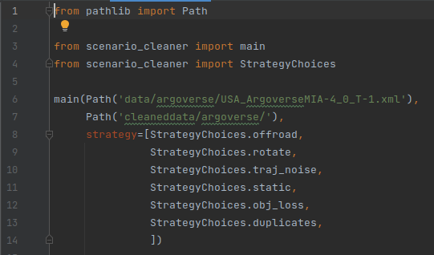

# MPFAV-dataset-reconstruction
The project is part of the **Motion Planning For Autonomous Vehicles** Practical Course and aims at improving the
quality of the provided dataset from [Argoverse](https://www.argoverse.org/). The dataset was converted into CommonRoad
scenarios which shall be cleaned from the following identified problems to make them more convenient:
- static obstacles
- rotating obstacles
- off-road detections
- trajectory noise
- object loss (object disappears and reappears later with different ID)
- overlapping duplicates

The repository provides first solutions to these problems.
***
## First steps
It is recommended to create a conda environment to run the applications on.

Install packages from provided requirements.txt:
```
pip install -r requirements.txt
```
Install other dependencies:
- [commonroad-io](https://gitlab.lrz.de/cps/commonroad-scenario-designer)
- [commonroad-drivability-checker](https://gitlab.lrz.de/cps/commonroad-drivability-checker) (for collision checker)
- [commonroad-scenario-designer](https://gitlab.lrz.de/cps/commonroad-scenario-designer) (for map repairing)
***
## Usage
We provide a command line interface (CLI) created with the [typer](https://typer.tiangolo.com/) package and a python
script `mainrun.py` which can be run e.g. in an environment like PyCharm.
### CLI
The application can be started by calling the python script 'scenario_cleaner.py`. By calling help further information
can be acquired.
```bash
$ conda activate environment
$ cd dataset-reconstruction
$ python scenario_cleaner.py --help 
```


The desired data cleansing algorithms can be called as follows:
```bash
# to call static obstacles filter
$ python scenario_cleaner.py INPUT_DIR OUTPUT_DIR --strategy static
# to call rotating obstacles filter and object loss filter
$ python scenario_cleaner.py INPUT_DIR OUTPUT_DIR --strategy rotate --strategy obj_loss
# to call all filters at once
$ python scenario_cleaner.py INPUT_DIR OUTPUT_DIR --strategy all
```
***
### Python Script in IDE
`mainrun.py` can be opened and the desired filters can be added or commented out with a `#`.
Then the input directory (can also be a file) and the output directory shall be defined. The **first Path** argument
represents the input path where as the **second Path** should contain the output directory.

The script can then be run to create new cleaned scenarios. This usage is especially useful for debugging or trying out
different kind of settings.



***
### Further adjustments
Some filters do not work perfectly or can be fine-tuned by defining certain parameters upfront.
In the `scenario_cleaner.py` file under the function `transform_scenario` the `roadside_parking_check` argument of the
is static cleaner is set to `False` as the conversion of static vehicles into parked vehicles is not working perfectly
and increases the runtime a lot. This can be set to `True`.

The Kalman Filter which is implemented in `clean_traj_noise.py` can also be adjusted. By default, the Extended Kalman
Filter with **Constant Acceleration and Constant Turn Rate** model is called. We also provide the Point Mass Model and
the Constant Velocity and Constant Yaw Rate Model which can be used instead. As before the setting can be changed in
`transform_scenario` but this time under the trajectory noise cleaner. It is also possible to set Process Noise Matrix Q
and Measurement Noise Matrix R to self defined values.
